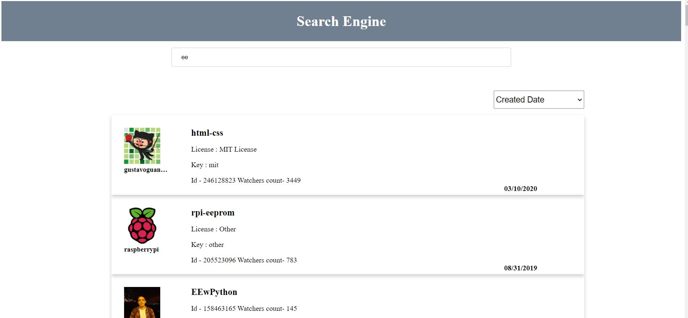

# git_search_engine

## Tech Stack
Angular CLI: 7.3.10

Node: 12.19.0

Angular: 7.2.16

rxjs: 6.3.3

   

## Setting up the code
   1. git clone the repository
   2. Open terminal and run "*npm install*". This will download and install all the required dependencies.
   3. On the terminal run "*ng start*" for running the application.
   4. Application will run on default port 4200.
   5. Go to browser and enter "*http://localhost:4200/*"
   6. In order to run the test cases, run "*ng test*" in the terminal.
   7. For test case coverage run "*ng test --watch=false --code-coverage*" in the terminal.

## Assumptions
   1. Sorting is on the client side. Server side sorting did not have many options available. So went with client side sorting.
   

## Preview of the app

## Test Coverage 

